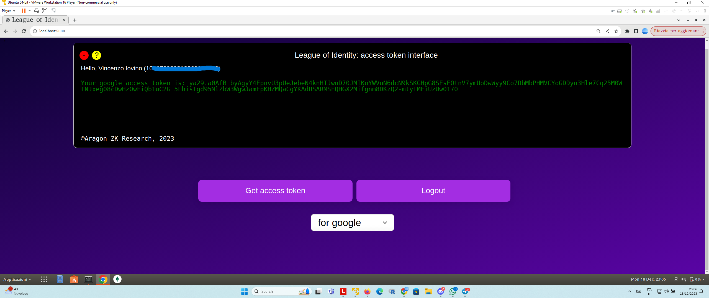

# League of Identity - PoC
## Overview
This repository provides a PoC implementation of the ``League of Identity `` (`LoI`)  system described in this [note](https://hackmd.io/noiVZo2dTJ6Wiejt2IJvMg?view). 

``LoI`` is a network of nodes with the following functionalities. ``LoI`` publishes what is called a ``master public key`` (``MPK``).
Alice logs into her own Google (or Facebook, Twitter, ...) account `alice@gmail.com` from a given `LoI` website and gets what is called an `OAuth 2` `access token`. Alice can send the so obtained `access token` to a sufficiently large set of nodes of `LoI` requesting to these nodes a cryptographic ``token`` corresponding to her email address and a given month and such set of nodes, upon verifying that the ``access token`` is valid, send back to Alice a set of `token shares` by means of which Alice can compute the (full) `token` corresponding to her email address and the specified month. The token can be relative to other identity information like a phone number or the social security number etc. (see below).
The token can be used for the following functionalities.
### Functionality of the `LoI` token
* Encryption. Bob can use the `MPK` of `LoI` to encrypt a message associated to `alice@gmail.com` and a given month and can publish the resulting ciphertext on a blockchain or send it directly to Alice. 
Alice can use the previously obtained `token` to decrypt the ciphertext received by Bob and recover the secret message.
We remark that the `token` is different from the `access token`.
	- Group encryption. Similarly, the token can be associated to a group. For instance, if Alice belongs to the company `oldcrypto` the token can be associated to the domain `@oldcrypto.com` and anyone can send encrypted messages to all members of such company. Specifically, if for instance `@oldcrypto.com` is a Google Business domain, Alice and Bob, belonging to the company, can log into their Google accounts and get tokens to decrypt ciphertexts associated to `@oldcrypto.com`.
* Signatures. The token can be used by Alice to sign transactions over blockchains (e.g. `Cosmos` ones) so that one can form a `Decentralized Autonomous Organization` (`DAO`) based on specific rules.
Consider the following applications scenarios:
	- The `DAO` of `@oldcrypto.com` can be created in the obvious way by issuing corresponding `tokens` to users of Gmail accounts with domain `@oldcrypto`. 
	- `LoI` can issue tokens to the holders of valid digital identity cards (`DIC`) and this would allow to create e.g., a `DAO` of the citizens of a given town or the DAO of < 18 years old teenagers. 
	- `LoI` can issue tokens corresponding to Instagram accounts with more than 1 million of followers thus creating a `DAO of Influencers`.
	- `LoI` can issue tokens corresponding to Ethereum NFTs held in a smart contract. The `LoI` token can be then used as a `bridge` in other blockchains or can be used in Ethereum itself for other functionalities: e.g., ZK proofs, encrypted data for DAO memembers.
	- `LoI` can issue tokens corresponding to Facebook accounts who are members of a given Facebook page and the `LoI` token can be then used e.g., on Ethereum or other blockchains as a mean to create a DAO of the members of that page. In particular the admins of the page can create a bridge between Facebook and web3 applications.

Moreover we envions the signature to satisfy the following property:
* Efficient on-chain verification. The verification of the signature should be efficient for web3 applications. For instance, it is efficient to verify signatures of digital identity cards off-chain but verifying such signatures on Ethereum would consume too much GAS. Instead, the `LoI` tokens for digital identity cards can be used to produce signatures that are efficiently verifiable in Ethereum and other blockchains.

We stress that `LoI` aims at offering both encryption and authentication/signatures at the same time: satisfying these two properties together is usually more challenging than achieving just one of them.


## Running a demo
The current demo only offers encryption and supports the following providers: `google`, `facebook, google.phone` and `dic.it`. The provider `google.phone` uses google as provider but associates to the users their profile phone numbers (when visible) rather than their email addresses. The provider `dic.it` is for Italian digital identity cards (tested on v3.0).

### Install the required packages
The demo has been tested using `node v16.20.2`.
You can switch to such version using the command:
```bash
nvm install 16.20.2
```
For the web part the only required package is `hello.js` but a stand-alone version is embedded in the `web` folder.
For the `node.js` part the required packages are (some of them could not be currently used) `fetch, express, nocache, cors, commander, console, fs, shelljs, body-parser` and [`noble-curves`](https://github.com/paulmillr/noble-curves).
To install them, run:
```bash
npm install --save express
npm install --save fetch
npm install --save nocache
npm install --save cors
npm install --save commander
npm install --save console
npm install --save fs
npm install --save shelljs
npm install --save body-parser
npm install --save @noble-curves@1.2.0
```
Note that for `noble-curves` we stick to the version `1.2.0` we used for the tests. You can try to use newer versions of `node` and `noble-curves` by tweaking the files (e.g., replacing `require` directives with `import` directives). If you have issues with fetch, try to install the version `1.1.0` that we used for the tests.

### Prerequisites
It is strongly suggested that you create a Google developer account and get your `client id` (see below). However, you will be able to run all the following commands even without that.
Instead, for Facebook you need a pair of `client id` and `secret id` to fill the parameters resp. `FACEBOOK_CLIENT_ID` and `FACEBOOK_SECRET_ID` in the file `src/loi_server.js`.
Similarly, for `google.phone` you need to fill the value `GOOGLE_API_KEY` in the same file with a Google API Key. 
### Get a Google (or Facebook) access token
You first need to run a web server on the port `5000`, for instance:
```bash
cd web
python3 -m http.server 5000
```

This is because the `main.js` file that implements the web page embeds a `Google client id` associated with domain `localhost:5000` so changing port will not work with that `client id`. It is strongly suggested that you create a Google developer account and setup your own project and get your own `client id`. Search the line containing the comment ``// client id`` in ``web/main.js`` and replace the corresponding value with your own `client id` . Similarly, for Facebook.
Then open the link ``localhost:5000`` in your browser, and click on ``Get access Token``, you should get some view like the following:
<br>

<br>

Copy the so obtained ``access token`` in your clipboard. Note that it has a validity of 1hour. We assume henceforth that the variable ``access_token`` contains the text you previously copied to your clipboard.
In this example I computed the token for my email ``vinciovino@gmail.com``.
You can select `facebook` from the menu to get a `facebook` access token.  In the case of facebook the users will be associated to the email addresses specified in their personal profiles.

Observe that in our example we are using a `http` website without `TLS`.
This is only for simplicity. However, be aware that, since we are in the setting of `OAuth implicit flow`, using non-secure connections could make your application insecure.
### Compute the shares and run the `LoI` nodes
Henceforth, we assume to be working in the folder `src`.
`LoI` is associated to two parameters: `n`, the number of nodes in the network, and `t`, the threshold of nodes who can reconstruct the secrets and break the security.
Let us assume henceforth that `t=2` and `n=3`.
Run the following command:

```bash
node compute_shares.js -t 2 -n 3
```
You will get an output like:
```bash
DEBUG: 1-th coefficient of the 1-degree polynomial: 22616172845692563875646944834802029969319479005231155265423472447676397078828
master secret key: 32d37d4b4f967edd1a92553792ee8decfe9c5f3f49fce4a64e0fdfa4093e43a4
master public key: 98a13c5e305dbad1a006441e59234870103240416f4ec443b930fb6762f80e9254bd78bd3f27ad599df9d522ee724256054221f3bdfe3f3f5233927ec7bd5f585d2f5c7d65bb8efbc36ea8cc24464f65274c40a78cdabda2ec02b5b796d0a2a8
share of the server 1: 64d3ca258dacbeb286faad11268223a5d999ae7cb997798606d69888bcb58cd0
share of the server 2: 22e66faca225813fc0292ce2b073e15960d959b72933b266bf9d516e702cd5fb
share of the server 3: 54e6bc86e03bc1152c9184bc440777123bd6a8f498ce474678640a5323a41f27
reconstructed master public key: 98a13c5e305dbad1a006441e59234870103240416f4ec443b930fb6762f80e9254bd78bd3f27ad599df9d522ee724256054221f3bdfe3f3f5233927ec7bd5f585d2f5c7d65bb8efbc36ea8cc24464f65274c40a78cdabda2ec02b5b796d0a2a8
```
Henceforth we will denote by `share1` (resp. `share2`, `share3`) the so computed `share of the server 1` etc.
So, in the following commands whenever we will write e.g., `share1` you need to replace it with the previous value.

The previous computation simulates the computation of `Distributed Key Generation` (`DKG`) procedure with a trusted dealer.
You can replace it with a real `DKG` procedure without trusted dealer but for simplicity we do not do that.

Now, you can run locally 3 `LoI` nodes with the following commands:
```bash
node loi_server.js -p 8001 -s share1 &
node loi_server.js -p 8002 -s share2 &
node loi_server.js -p 8003 -s share3 &
```
Do not forget to replace `share1`, `share2`, `share3` with the previously computed values. This runs 3 servers on the respective ports `8001`, `8002`, `8003`.
Each server is implicitly associated resp. with the index `1,2,3`.
### Get a `token` from `LoI`.
Now you can run the following:
```bash
node get_token.js -A access_token -t 2 -n 3 -l 2 http://localhost:8002 3 http://localhost:8003
```
Do not forget to replace ``access_token``  with the value computed before (see above).
The argument `-A` specifies the `access_token`. The arguments `-t` and `-n` first correspond to the aforementioned values `t=2,n=3`. The argument `-l` specifies a list `2 http://localhost:8002` and `3 http://localhost:8003` to denote that we want to request the `token shares` from the nodes with indices `2` and `3`.
If you want to do the request e.g. to the nodes `1,3` you would need to replace `-l 2 http://localhost:8002 3 http://localhost:8003` with `-l 1 http://localhost:8001 3 http://localhost:8003`.
Here, we request a `token` for the current month. Use the option `-m month.year` to get a `token` for a past month. The value `month` in the string `month.year` is an integer between 0 and 11 and `year` has the form `XXXX`. Moreover, use the option `--group` if you want a `token` for a group. Use the option `-P provider` to switch to a different provider (e.g., `facebook`); the default provider is `google`.

You will get an output like: 
```bash
Value received by server 2 (http://localhost:8002): LoI..google..vinciovino@gmail.com..11..2023..a498c6a0508adbfe812475fbee2da1230fc2068dfd4d07e438ba59f7307cb637b87ff30a3b16a1bc3996c4ac202f2ad304247e020d293fb42f71f5e0c8e14dd5c8a8da925397cba2262453f85b83e3947f6fd3a6c8f937461a728712b4603414..ada3cfb63fd3fe0e45e0537dbeeb62c3a9b8e237a5a92c8a0fc47fc0223c7a7f0d0db5ea588f628a522d79fd8b8b75cc
Value received by server 3 (http://localhost:8003): LoI..google..vinciovino@gmail.com..11..2023..aa653eeeb7ec24a296a67980efd5b069013e3a1df79c879126036e7cf88932d4c32a85088e5a856d618744f2d2e7b42c0e31e25b7581ca10aee77cd0a4d80a039b868e71c730571441d8478b112f317cb79a6a7f06157550c4d7fa559f57681c..a1c5f1131b810fcf76bdc497b2fbf7ffefe3825886e229e85f7f86dc672637a80c8db0e972e8d101035a4e5d74fa80e9
reconstructed master public key: 88b8aa62727da6ab4a10d077a4e5cfe038695925f037db5b7c91efa824d1b7ad80056083077e592f00142ac6abf208d30e4b962b94e2fc8c759a7c6faab7b2f8718b3a8cb156da061176ddeaefb13a6c3568a9614608bddc67f982a1d710d28e
reconstructed token: af5c3a2d675f8750ea1a416c8064c912ccd46e935e16b31a1906532a1ab95646924c31f153a5e030d40118923e9421f5
Verification of reconstructed token: success.
```

Henceforth we will denote by `mpk` the so computed `master public key`.
So, in the following commands whenever we will write e.g., `mpk` you need to replace it with the previous value. Similarly, for the string `token`.
Note that the reconstructed `mpk` computed by the previous command is just used for debug purposes. In real applications one should use as master public key the one that is made public by the `LoI` members at the launch of the system.

### Encrypt
Let us assume that the secret message to encrypt is the string ``aa`` and it is contained in the file `msg`.
Run the following command to encrypt under my email ``vinciovino@gmail.com`` with the tag of ``December 2023``:

```bash
node encrypt.js -k mpk -e vinciovino@gmail.com -m 11.2023 < msg
```
You will get something like:
```bash
ciphertext: 2.afacb96209bc9c9f9e8e1484aee1a42ecd08488f487cc30eac89bee7ebffb3327040e3bcf77c9378e646ec118fb9ba2004b734a0502f3c3df658660041659a5582ce9e662ccfefb68dd2a421227676a79b529a11d1c474526c253ff57cb15a82.6b5d
```
Henceforth, let us assume that the previous ciphertext is contained in the variable ``ciphertext``.

Note that in order to encrypt for `December` we used `11.2023` not `12.2023`. This is because the `month` field starts from `0`, that is it is an integer between `0` and `11`.

### Decrypt
Now, you can decrypt with the following command:
```bash
node decrypt.js -T token -k mpk -e vinciovino@gmail.com -m 11.2023 -c ciphertext
Verification of token: success.
aa
```
You should get in the end the recovered message contained in the file ``msg``.

### Phone number encryption (`phencryption`)
With the provider `google.phone` you can specify phone numbers to the argument `-e` in the above commands and you will be able to encrypt/decrypt with respect to phone numbers that are verified in public profiles of Google users.
### CCA2-security
With the option `-cca2` to both `encrypt.js` and `decrypt.js` you can require security against adaptive chosen ciphertext attacks (`IND-CCA2`), the strongest form of security for encryption. The decrypted message will start with a character that is either `1` or `0` depending on whether the decryption was successful or not. 
### Signatures
The commands `node sign.js` and `node verify.js` allow resp. to sign and verify signatures. We defer the programs' interface to the help provided by the `--help` option.
### Group encryption/signatures
For group encryption/signatures  specify the `--group` option to the `get_token.js` command and specify the domain (e.g., `oldcrypto.com`) instead of a full email in the other commands.
### Anti-spam token
With the `facebook` token you can specify the option `--friends X` (to all commands) to associate the token only to Facebook users with at least `X` number of friends. This may have applications as anti-spam tool in blockchains since it makes harder to create fake users.
### Anonymity 
With the option `-anonymous` to `get_token.js` it is possible to request a token associated to an identity equal to the access token string specified to the argument `-A`; in such case you need to specify the access token string to the argument `-e` of all other commands.
For security the servers should check whether the access token has not been already used but this is not done in the current demo.

This option is compatible with the option `--group`; in such case you need to specify identities of the form `AT@domain` to the argument `-e` of the `encrypt.js, decrypt.js, sign.js, verify.js` commands, where `AT` is the access token specified to the `-A` argument of the `get_token.js` command.

### Digital Identity Cards
The flow to use digital identity cards (`DICs`) is the following. The following example is for the Italian `DIC` but we will later show how to generalize it to virtually any `DIC` that supports signing documents (not all `DIC` do support signing but in the near future many countries will adopt it).
With the command:

```bash
node get_token.js  -t 2 -n 3 -l 2 http://localhost:8002 3 http://localhost:8003  -A null -P dic.it -j challenge.json 
```
one gets from the chosen `LoI` nodes (in this case the ones with indices `2` and `3`) a `challenge` file `challenge.json`. Observe that we specify `null` as parameter to `-A` since no `access token` is actually needed for `DICs`.
The file `challenge.json` contains some random challenges with corresponding generation times. The user is asked to sign this file with his/her own `DIC` within 30mins. In real world applications this file could be replaced by a contract in PDF form to be signed with the user's `DIC` as it is the case in many public administrations websites.

Let us say that the user signs the aforementioned file with his/her own `DIC` (this depends on the specific country, in Italy it can be done with the official App `CIEID` even though other Apps are available as well) and let us assume that the signed file is `challenge.json-signed.p7m`. Note that `.p7m` is the usual standard for signed files.
Then the user submits the following command:
```bash
node get_token.js   -t 2 -n 3 -l 2 http://localhost:8002 3 http://localhost:8003  -A null -P dic.it -s challenge.json-signed.p7m
```
and gets something like:
```bash
DEBUG: the server 2 accepted the signed document.
LoI..dic.it..XXXXXXXXXXXXXXXXXXXX..11..2023..a498c6a0508adbfe812475fbee2da1230fc2068dfd4d07e438ba59f7307cb637b87ff30a3b16a1bc3996c4ac202f2ad304247e020d293fb42f71f5e0c8e14dd5c8a8da925397cba2262453f85b83e3947f6fd3a6c8f937461a728712b4603414..a72d41f75297ff2f735e34051fd643a2a6a3d06a8918406e8c0ef61b89127447182e3366652d5dc590bf2a9b3a0f8152..null..0
DEBUG: the server 3 accepted the signed document.
LoI..dic.it..XXXXXXXXXXXXXXXXXXXX..11..2023..aa653eeeb7ec24a296a67980efd5b069013e3a1df79c879126036e7cf88932d4c32a85088e5a856d618744f2d2e7b42c0e31e25b7581ca10aee77cd0a4d80a039b868e71c730571441d8478b112f317cb79a6a7f06157550c4d7fa559f57681c..84072d75fea0b315407c6c32d68d0e2428184bad56302cc5f920a33b34139b0c27aec13cdd5962d8ff4374788f3f0503..null..0
reconstructed master public key: 88b8aa62727da6ab4a10d077a4e5cfe038695925f037db5b7c91efa824d1b7ad80056083077e592f00142ac6abf208d30e4b962b94e2fc8c759a7c6faab7b2f8718b3a8cb156da061176ddeaefb13a6c3568a9614608bddc67f982a1d710d28e
DEBUG: token is for email: XXXXXXXXXXXXXXXXXXXX
reconstructed token: a412949c279d85583f1a7918e3883e41378562f3127b0d915bd720ddf2f64df72ced2be7941c34409d6c96ce81fb1821 for identity LoI..dic.it..XXXXXXXXXXXXXXXXXXXX..11..2023..null..0
DEBUG: Verification of reconstructed token: success.
```
In the previous output, for privacy reasons, I replaced my own Social Security Number (`SSN`) that corresponds to the Italian `codice fiscale` with the string `XXX....X`.
One can also issue the same command with the option `-anon` to get a token for the `identifier` corresponding to the `SSN`. The difference is that the `SSN` may usually contain private information. For example in Italy the `SSN` exposes your birth date and birth place and some characters of your name. Indeed, the Italian `SSN` is a deterministic function of name, surname, birth date, birth place and you can get the `SSN` of any Italian citizen if you know such data. Instead, the `identifier` obtained through the `-anon` option should be only known to governmental entities so it is somehow `more anonymous`.

Once you get the token you can issue the commands `encrypt.js, decrypt.js, sign.js, verify.js` with respect to such token specifying as parameter to the option `--email` the `SSN` or the `identifier` (depending on whether the token was issues without or with the option `-anon`).


To generalize the functionality to `DIC` issued by other countries the modifications should be the following.
For the Italian `DIC` there is a folder `dic/it` containing the Italian `local issuer certificates`, that is the certificates under which the certificate of an owner of an Italian `DIC` is signed.
For other countries you would just need to create separate folders containing the right `local issuer` certificates of the country to support. Moreover, the Italian certificate provides in the field `commonName` a string of the form `X/Y` where `X` is the user's `SSN` and `Y` is the `identifier` of such `SSN`. Each country may have different standards. 
For example the Italian `DIC` provides in the `serialNumber` field the identity number of the `DIC` itself that can be alternatively used as identity information.

Notes: the current implementation does not check if the signed file was signed by a user whose `DIC` certificate was revoked. This should be easy to add using the country specific `OCSP` service. Moreover there are two types of `local issuer certificates` for Italy and the current implementation assumes that each certificate is signed under only one of them so it will fail when a user certificate is signed by the second local issuer certificate.
#### Creating DAOs of citizens younger or older than a given age
With the option `--age <value>` it is possible to require that the token be granted only to citizens that are either born in the year `value` or after if `value` is a positive integer of the form `XX` or born in the year  `-value` if `value` is a negative integer of the form `-XX`.
If for example we use the option `--age 90` (or `--age -90`) for a user with `SSN` (or `identifer` depending on whether the option `--anon` is not used or is used) equal to `Z` we should then specify `--email 90@Z` (or `--email -90@Z`) to the commands `encrypt, decrypt, sign, verify`. 
Note that this option is very powerful along with the option `--anon`. Indeed, in this case the user is identifed by an `email` of the form `90@Z` (or `-90@Z`) where `Z` is somehow anonymous and notwithstanding a smart contract can differentiate the age of the user to create e.g. the DAO of citizens that are born after 1990 (or before). 
Our formulation of the age information is tailored for the Italian `DIC` and could be different for other cards.

#### About creating the DAO of the citizens of a given town or province
Unfortunately, `DICs` do not usually contain info like the Town of residency of the citizen.
However, a `DIC` does often store another certificate signed with the citizen's certificate that in turn does contain additional information like the town, street, etc. of residency of the citizen.
Therefore, it should be possible to extend the current demo to have the user to send this additional certificate in order to get a token corresponding e.g. to a given town.

## References
Vincenzo Iovino, Aragon ZK Research. [League of Identity: distributed identity-based encryption and authentication from Google and other providers](https://hackmd.io/noiVZo2dTJ6Wiejt2IJvMg?view), 2023.
